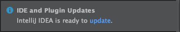

# Table of Contents

+ [Setup](#markdown-header-setup)
  * [Software](#markdown-header-software)
    + [Java](#markdown-header-java)
  * [IDE](#markdown-header-ide)
  * [Maven](#markdown-header-maven)
  * [ChromeDriver](#markdown-header-chromedriver)
  * [IntellIJ](#markdown-header-intellij)
    + [Profiles](#markdown-header-profiles)
      -	[Adding Maven profile](#markdown-header-adding-maven-profile)
      -	[Adding a JUnit profile](#markdown-header-adding-junit-profile)
    + [Plugins](#markdown-header-plugins)
      -	[Cucumber for Java](#markdown-header-cucumber-for-java)
      -	[Gherkin](#markdown-header-gherkin)
+ [Project Structure](#markdown-header-project-structure)
+ [Features Files](#markdown-header-features-files)
+ [Running Test Cases](#markdown-header-running-test-cases)
+ [Getting the report](#markdown-header-getting-the-report)
+ [Considerations](#markdown-header-considerations)


# Setup
## Software
### Java

Java `version 8` is required in order to run this automation framework. Selenium does not support newer version of Java. Download Java 8 from the following link:

- [Java 8 SDK](https://www.oracle.com/technetwork/java/javase/downloads/jdk8-downloads-2133151.html)

## IDE

The recommended **IDE** to run this automation framework is **IntelliJ IDEA** version 2018.

- [2018.3.6 for MacOS](https://download.jetbrains.com/idea/ideaIC-2018.3.6.dmg)
- [2018.3.6 for Windows](https://download.jetbrains.com/idea/ideaIC-2018.3.6.exe)
- [2018.3.6 for Linux](https://download.jetbrains.com/idea/ideaIC-2018.3.6.tar.gz)

> :exclamation: **Note**: versions newer than 2018 cause conflict with Cucumber plugin

## Maven

Maven is required to download the dependencies of the project.

> There are several ways to get Maven, one of them is to get the Maven`s Binary from the official link:

- [Maven](https://maven.apache.org/download.cgi)

### Install Maven on different OS Systems

- **for MacOS**:

  Open a terminal and type the following command:

```bash
$ brew install maven
```

- **for Linux Systems**

  Please follow the next guide in order to get Maven for Linux Systems

- [Install Apache Maven on Linux](https://www.javahelps.com/2017/10/install-apache-maven-on-linux.html)


- **for Windows Systems**

  Please follow the next guide in order to get Maven for Windows Systems

- [Install Apache Maven on Windows](https://docs.wso2.com/display/IS323/Installing+Apache+Maven+on+Windows)


## ChromeDriver

ChromeDriver is required by Selenium in order to run the automated tests. It allows the framework to control Chrome browser.

> There are several ways to get the ChromeDriver, one of them is to get the ChromeDriver's Binary from the official link:

- [ChromeDriver](http://chromedriver.chromium.org)

### Install ChromeDriver on different OS Systems

- **for MacOS**:

  ```bash
  $ brew cask install chromedriver
  ```

- **for Linux**:

  Please follow the next guide in order to get the ChromeDriver for Linux Systems

- [Install Google Chrome Driver on Linux](https://tecadmin.net/setup-selenium-chromedriver-on-ubuntu)


- **for Windows Systems**

  Please follow the next guide in order to get Maven for Windows Systems

- [Install Chrome Driver on Windows](https://www.kenst.com/2019/02/installing-chromedriver-on-windows)

## IntellIJ

### Profiles
The IDE needs a couple of profiles in order to run this automation

#### Adding Maven profile

1 - In the upper right click in `Add Configuration...`

  

2 - Click on `plus` icon to `Add New Configuration` and select `Maven`

    

3 - Under `Parameters` tab setup the following inputs:

   1. **Working directory**: `<automation folder absolute path>`
   2. **Command line**: `clean install`
       

4 - Under `Runner` tab setup the following inputs:

   1. **JRE**: `<Java version 1.8>`
            

#### Adding JUnit profile

1 - In the upper right click in `Add Configuration...`

  

2 - Click on `plus` icon to `Add New Configuration` and select `JUnit`

  

3 - Under `Configuration` tab setup the following inputs:

   1. **Name**:  `<any name>`
   2. **Class** = com.etaluma.scopesmart.E2ETest
   3. **Working directory**: `<automation folder absolute path>`
   4. **User class path of module**: TestAutomation
   5. **JRE**: `<Java version 1.8>`


### Plugins
This project needs to the following plugins in order to run

#### Cucumber for Java

1 - In IntelIJ select the following option: `InteliJ IDEA > Preferences... > Plugins`

  

2 - Search for `Cucumber for Java` and install it

  

#### Gherkin

1 - In IntelIJ select the following option: `InteliJ IDEA > Preferences... > Plugins`

  

2 - Search for `Gherkin` and install it

  

## Project Structure

At this point you should have the following `File > Project structure`

  

> In case it is not so, please mark the folders in the corresponding category

# Features Files

To know more about the features files please read the following article :point_right: [What is a feature file](https://www.toolsqa.com/cucumber/cucumber-jvm-feature-file)

## Tags Description

The following tags are inside every feature file in the automation

- `@Automation`: This is a **global tag** used to run every feature file in the automation and it is located at the beginning of each feature file and as second tag in every Scenario/Scenario Outline


- `@ModuleFolder`: This tag is used to run every feature file inside the folder


- `@FeatureFileName`: This tag is used to run all the scripts within the feature file


- `@@UserStoryTSS-###`: This tag is used to recognize what story belongs the feature file


-  `@TSS-####`: This tag is used to recognize what is their Test Execution in Jira


- `@TEST_TSS-####`: This tag is used to recognize what is their Jira Ticket


## Scenarios
The scenario is one of the core structures of the Gherkin language. Scenario includes all the possible circumstances of the feature and test scripts for these circumstances

The automation uses two kind of Scenarios, which are

1. Scenario
2. Scenario Outline

### Scenario
Scenario is the keyword which is used to run once


- **Scenario With Strings**
Please see the following image to get a clear example of the use of a Scenario using strings:


### Scenario Outline
In Gherkin language, scenario outline is the keyword which is used to run the same scenario multiple times


- **Scenario Outline Variables**

Please see the following image to get a clear example of a Scenario Outline with Variables:


- **Scenario Outline with Tables**


Please see the following image to get a clear example of a Scenario Outline with Tables


> Notice that this tables also works with a Scenario

# Running Test Cases

## By tag

1 - Open any feature file from the folder `testautomation > src > test > resources > features` and select a **tag**, e.g:  `@LoginPAge`

  

2 - Open the file `testautomation > src > test > java > com > etaluma > scopesmart > E2ETest.java` and in **tags** put the one selected in the previous step


3 - Select the **JUnit** profile created previously and click on Run button


4 - You will see the test running in the In the bottom left


# Jira
Each ticket in Jira have labels, these labels have different purposes.
To differentiate the tickets from the Manual part vs Automation please see the table below

| @Labels          | Automated      | Automation | Comments                                                                                         |
|------------------|----------------|------------|--------------------------------------------------------------------------------------------------|
| Manual Test      | Yes (if apply) | No         | The Automated tag only applies when there is an script in automation side to cover this feature. |
| Automation Test  | No             | Yes        |                                                                                                  |

# Getting the report

Once you have run some tests a report called `ExtendHtml.html` is available in the following path: `testautomation > HtmlReport`

The report will look as follows:


- Search by Module Folder

In the following example the search returns all the scripts related to the `module folder tag`:


- Bugs

In the following example, all the related bugs found during the execution are shown:


- Statistics

In the following example, the statistics related to the execution are shown:


# Considerations

## Do not update IntellIJ
As we mentioned before, the `Cucumber Plugin` works with a specific version of the IDE IntellI, see the following section for more information: [IDE](#markdown-header-ide) 

If the IDE shows the following tooltip:

  

:exclamation: Please **DON'T DO IT**, update it will cause that the automation does not run and quite possibly you will have to setup all again.